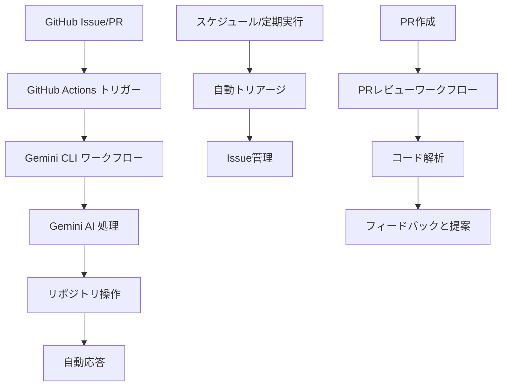

<div align="center">
# ジェミニ・アクション・ラボ

<a href="./README.md"></a>
<a href="./README.ja.md"></a>


</div>

---

## 📖 概要

このリポジトリは、GoogleのGemini AIをGitHub Actionsと統合するための実験室およびショーケースとして機能します。生成AIの力を利用して、さまざまなリポジトリ管理タスクを自動化する方法を示します。

### 🎯 主な機能
- **AIによる自動化**: Geminiを活用して、Issueのトリアージ、プルリクエストのレビューなどのタスクを処理します。
- **CLIライクな対話**: Issueのコメントから直接AIアシスタントと対話します。
- **拡張可能なワークフロー**: 独自のプロジェクトに合わせてワークフローを簡単に適応およびカスタマイズできます。

---

## 🤖 ワークフロー

このリポジトリには、以下のGitHub Actionsワークフローが含まれています：

### 📄 `gemini-cli-jp.yml`
- **トリガー**: Issueのコメント
- **機能**: ユーザーがIssueにコメント（例：`@gemini-cli-jp /do-something`）を作成することで、Gemini搭載のCLIアシスタントと対話できるようにします。アシスタントは、ユーザーのリクエストに基づいてリポジトリでアクションを実行できます。

###  triage `gemini-issue-automated-triage.yml`
- **トリガー**: Issueの作成または編集
- **機能**: 新規または更新されたIssueを自動的にトリアージします。Geminiによって決定されたIssueの内容に基づいて、ラベルの追加、担当者の割り当て、またはコメントの投稿ができます。

### 🕒 `gemini-issue-scheduled-triage.yml`
- **トリガー**: スケジュールされたcronジョブ
- **機能**: 定期的にオープンなIssueをスキャンし、古いIssueの特定や優先順位の提案などのトリアージタスクを実行します。

### 🔍 `gemini-pr-review.yml`
- **トリガー**: プルリクエストの作成または更新
- **機能**: プルリクエストを自動的にレビューします。Geminiは、コードの品質に関するフィードバックの提供、改善の提案、または潜在的な問題の特定ができます。

### 🔄 `sync-to-report-gh.yml`
- **トリガー**: mainブランチへのプッシュ
- **機能**: これは以前のテンプレートからのレガシーワークフローであり、このラボでは積極的に使用されていません。日次レポートを中央リポジトリに同期するように設計されていました。

---

## 📸 スクリーンショット & 例

### 🤖 CLI 対話例
Issueを作成して `@gemini-cli-jp /help` とコメントすることで、使用可能なコマンドを確認できます：

```
@gemini-cli-jp /help
```

AIアシスタントは、使用可能なコマンドと使用例で応答します。

### 🏗️ ワークフローアーキテクチャ


### 💬 使用例

**コードレビューリクエスト:**
```
@gemini-cli-jp /review-pr
このプルリクエストを確認して改善点を提案してください
```

**Issueトリアージ:**
```
@gemini-cli-jp /triage
このIssueを分析して適切なラベルと担当者を提案してください
```

---

## 🛠️ トラブルシューティング

### よくある問題

**❌ ワークフローがトリガーされない:**
- リポジトリ設定でGitHub Actionsが有効になっているか確認してください
- リポジトリ設定でWebhook配信を確認してください
- トリガー条件（例：コメント内の `@gemini-cli-jp`）が満たされているか確認してください

**❌ Gemini API エラー:**
- `GEMINI_API_KEY` シークレットが設定されているか確認してください
- APIキーの権限とクォータを確認してください
- APIキーが有効で期限切れでないか確認してください

**❌ 権限エラー:**
- ユーザーに書き込み権限があるか確認してください
- リポジトリがプライベートかどうか確認してください（信頼できるユーザーの検出に影響します）

### ヘルプの取得
1. 同様の問題がないか [GitHub Issues](https://github.com/your-repo/issues) を確認してください
2. 詳細なエラーログを添えて新しいIssueを作成してください
3. 報告時にはワークフローの実行ログを含めてください

---

## � 使い方

これらのワークフローを独自のリポジトリで使用するには、`.github/workflows`ディレクトリからワークフローファイルをコピーし、ニーズに合わせて適応させます。Gemini APIキーなどの必要なシークレットを設定する必要があります。

---

## 📁 ディレクトリ構造

```
.
├── .github/
│   └── workflows/
│       ├── gemini-cli-jp.yml
│       ├── gemini-issue-automated-triage.yml
│       ├── gemini-issue-scheduled-triage.yml
│       ├── gemini-pr-review.yml
│       └── sync-to-report-gh.yml
├── .gitignore
├── LICENSE
└── README.md
```

---

## 📝 ライセンス

このプロジェクトは、[LICENSE](LICENSE)ファイルの条件に基づいてライセンスされています。

---

© 2025 Sunwood-ai-labsII
