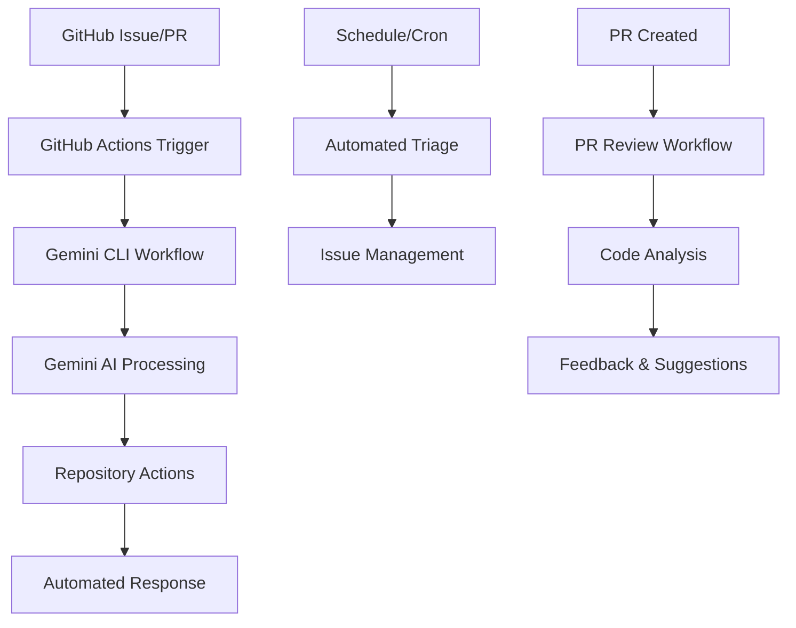

<div align="center">

# Gemini Actions Lab

<a href="./README.md"></a>
<a href="./README.ja.md"></a>


</div>

---

## 📖 Overview

This repository serves as a laboratory and showcase for integrating Google's Gemini AI with GitHub Actions. It demonstrates how to automate various repository management tasks using the power of generative AI.

### 🎯 Key Features
- **AI-Powered Automation**: Leverage Gemini to handle tasks like issue triage, pull request reviews, and more.
- **CLI-like Interaction**: Interact with the AI assistant directly from issue comments.
- **Extensible Workflows**: Easily adapt and customize the workflows for your own projects.

---

## 🤖 Workflows

このリポジトリは、GoogleのGemini AIをGitHub Actionsと統合するための実験室およびショーケースとして機能します。生成AIの力を利用して、さまざまなリポジトリ管理タスクを自動化する方法を示します。

### 🎯 主な機能
- **AIによる自動化**: Geminiを活用して、Issueのトリアージ、プルリクエストのレビューなどのタスクを処理します。
- **CLIライクな対話**: Issueのコメントから直接AIアシスタントと対話します。
- **拡張可能なワークフロー**: 独自のプロジェクトに合わせてワークフローを簡単に適応およびカスタマイズできます。

---

## 🤖 ワークフロー

このリポジトリには、以下のGitHub Actionsワークフローが含まれています：

### 📄 `gemini-cli-jp.yml`
- **トリガー**: Issueのコメント
- **機能**: ユーザーがIssueにコメント（例：`@gemini-cli-jp /do-something`）を作成することで、Gemini搭載のCLIアシスタントと対話できるようにします。アシスタントは、ユーザーのリクエストに基づいてリポジトリでアクションを実行できます。

###  triage `gemini-issue-automated-triage.yml`
- **トリガー**: Issueの作成または編集
- **機能**: 新規または更新されたIssueを自動的にトリアージします。Geminiによって決定されたIssueの内容に基づいて、ラベルの追加、担当者の割り当て、またはコメントの投稿ができます。

### 🕒 `gemini-issue-scheduled-triage.yml`
- **トリガー**: スケジュールされたcronジョブ
- **機能**: 定期的にオープンなIssueをスキャンし、古いIssueの特定や優先順位の提案などのトリアージタスクを実行します。

### 🔍 `gemini-pr-review.yml`
- **トリガー**: プルリクエストの作成または更新
- **機能**: プルリクエストを自動的にレビューします。Geminiは、コードの品質に関するフィードバックの提供、改善の提案、または潜在的な問題の特定ができます。

### 🔄 `sync-to-report-gh.yml`
- **トリガー**: mainブランチへのプッシュ
- **機能**: これは以前のテンプレートからのレガシーワークフローであり、このラボでは積極的に使用されていません。日次レポートを中央リポジトリに同期するように設計されていました。

---

## 📸 Screenshots & Examples

### 🤖 CLI Interaction Example
Create an issue and comment with `@gemini-cli /help` to see available commands:

```
@gemini-cli /help
```

The AI assistant will respond with available commands and usage examples.

### 🏗️ Workflow Architecture


### 💬 Example Interactions

**Code Review Request:**
```
@gemini-cli /review-pr
Please review this pull request and suggest improvements
```

**Issue Triage:**
```
@gemini-cli /triage
Analyze this issue and suggest appropriate labels and assignees
```

---

## 🛠️ Troubleshooting

### Common Issues

**❌ Workflow not triggering:**
- Check if GitHub Actions are enabled in repository settings
- Verify webhook delivery in repository settings
- Ensure the trigger conditions are met (e.g., `@gemini-cli` in comment)

**❌ Gemini API errors:**
- Verify `GEMINI_API_KEY` secret is configured
- Check API key permissions and quota
- Ensure the API key is valid and not expired

**❌ Permission errors:**
- Confirm the user has write permissions
- Check if the repository is private (affects trusted user detection)

### Getting Help
1. Check the [GitHub Issues](https://github.com/your-repo/issues) for similar problems
2. Create a new issue with detailed error logs
3. Include workflow run logs when reporting issues

---

## 🚀 Installation & Setup

### Prerequisites
- GitHub account with repository creation permissions
- Gemini API key from Google AI Studio
- Basic understanding of GitHub Actions

### Quick Start
1. **Fork this repository** to your GitHub account
2. **Configure GitHub Secrets** in your repository settings:
   - `GEMINI_API_KEY`: Your Gemini API key
   - `GITHUB_TOKEN`: (automatically provided)
3. **Copy workflow files** from `.github/workflows/` to your repository
4. **Customize workflows** according to your needs
5. **Test the setup** by creating an issue and commenting `@gemini-cli /help`

### Advanced Configuration
For additional features, configure these optional secrets:
- `APP_ID` and `APP_PRIVATE_KEY`: For GitHub App integration
- `GCP_WIF_PROVIDER` and related GCP variables: For Vertex AI usage

---

## 🛠️ Troubleshooting

### Common Issues

**❌ Workflow not triggering:**
- Check if GitHub Actions are enabled in repository settings
- Verify webhook delivery in repository settings
- Ensure the trigger conditions are met (e.g., `@gemini-cli` in comment)

**❌ Gemini API errors:**
- Verify `GEMINI_API_KEY` secret is configured
- Check API key permissions and quota
- Ensure the API key is valid and not expired

**❌ Permission errors:**
- Confirm the user has write permissions
- Check if the repository is private (affects trusted user detection)

### Getting Help
1. Check the [GitHub Issues](https://github.com/your-repo/issues) for similar problems
2. Create a new issue with detailed error logs
3. Include workflow run logs when reporting issues

---

## 🚀 Installation & Setup

### Prerequisites
- GitHub account with repository creation permissions
- Gemini API key from Google AI Studio
- Basic understanding of GitHub Actions

### Quick Start
1. **Fork this repository** to your GitHub account
2. **Configure GitHub Secrets** in your repository settings:
   - `GEMINI_API_KEY`: Your Gemini API key
   - `GITHUB_TOKEN`: (automatically provided)
3. **Copy workflow files** from `.github/workflows/` to your repository
4. **Customize workflows** according to your needs
5. **Test the setup** by creating an issue and commenting `@gemini-cli /help`

### Advanced Configuration
For additional features, configure these optional secrets:
- `APP_ID` and `APP_PRIVATE_KEY`: For GitHub App integration
- `GCP_WIF_PROVIDER` and related GCP variables: For Vertex AI usage

---

## 📁 ディレクトリ構造

```
.
├── .github/
│   └── workflows/
│       ├── gemini-cli-jp.yml
│       ├── gemini-issue-automated-triage.yml
│       ├── gemini-issue-scheduled-triage.yml
│       ├── gemini-pr-review.yml
│       └── sync-to-report-gh.yml
├── .gitignore
├── LICENSE
└── README.md
```

---

## 📝 ライセンス

このプロジェクトは、[LICENSE](LICENSE)ファイルの条件に基づいてライセンスされています。

---

© 2025 Sunwood-ai-labsII
